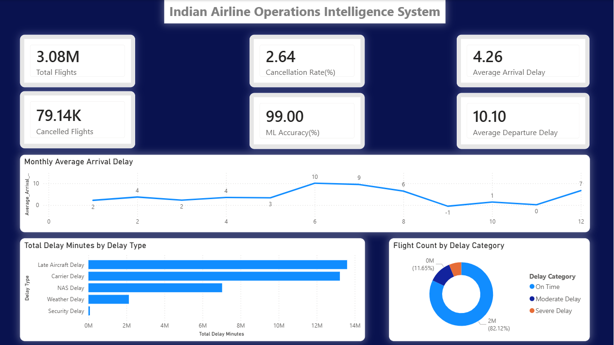
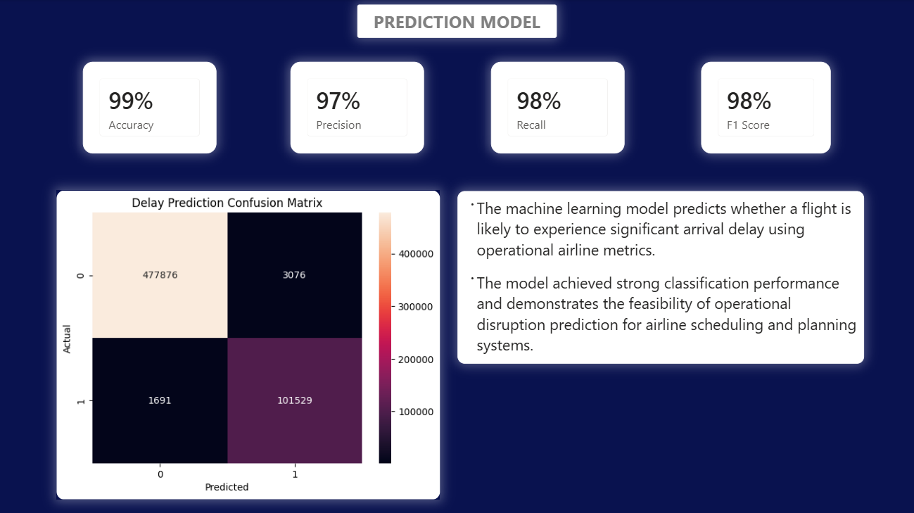

## Dataset Information

Due to GitHub file size limitations, the complete datasets are not included in this repository.

Datasets used:
- Indian Airline Operations Dataset
- Airline Delay Dataset
- Airport Metadata Dataset

Dataset sources:
- Kaggle
- OurAirports

# Indian Airline Operations & Delay Intelligence System

## Project Overview

This project analyzes airline operational performance, airport congestion, flight delays, and disruption patterns using large-scale aviation datasets.

The system combines:
- operational KPI analysis
- exploratory data analysis
- disruption intelligence
- machine learning-based delay prediction

to generate actionable airline operational insights.

---

## Business Problem

Airline operations are highly sensitive to delays, congestion, and cascading disruptions. Identifying operational inefficiencies and predicting delay risks can support better scheduling, resource allocation, and operational planning.

---

## Objectives

- Analyze airline operational performance
- Identify major delay contributors
- Evaluate airport congestion patterns
- Detect disruption-prone routes
- Perform operational trend analysis
- Build a flight delay prediction model

---

## Technologies Used

- Python
- Pandas
- NumPy
- Matplotlib
- Seaborn
- Scikit-learn
- Jupyter Notebook
- Git & GitHub
- Power BI (In Progress)

---

## Dataset Information

Due to GitHub file size limitations, the complete datasets are not included in this repository.

Datasets used:
- Indian Airline Operations Dataset
- Airline Delay Dataset
- Airport Metadata Dataset

Dataset sources:
- Kaggle
- OurAirports

## Key Analyses Performed

### Operational KPI Analysis
- Total flights
- Cancellation rate
- Average delays
- Airline operational performance

### Exploratory Data Analysis
- Delay distribution
- Monthly delay trends
- Airport congestion analysis
- Delay cause analysis

### Advanced Operational Analytics
- Delay severity classification
- Route performance analysis
- Peak congestion analysis

### Machine Learning
- Logistic Regression delay prediction model
- Confusion matrix evaluation
- Classification performance analysis

---

## Machine Learning Results

The delay prediction model achieved strong classification performance:

- Accuracy: 99%
- Precision: 97%
- Recall: 98%
- F1 Score: 98%

The model demonstrates the feasibility of operational disruption prediction using airline operational metrics.

---

## Dataset Information

Due to GitHub file size limitations, the complete datasets are not included in this repository.

Datasets used:
- Airline Operations Dataset
- Flight Delay Dataset
- Airport Metadata Dataset

Dataset Sources:
- Kaggle
- OurAirports

---

## Project Structure

data/
├── raw/
├── cleaned/
├── processed/

notebooks/
├── 01_data_understanding.ipynb
├── 02_business_kpi_analysis.ipynb
├── 03_operational_eda.ipynb
├── 04_advanced_operational_analysis.ipynb
├── 05_delay_prediction_model.ipynb

dashboards/
reports/
images/

---

## Future Improvements

- Interactive Power BI dashboard
- Real-time operational monitoring
- Advanced ensemble machine learning models
- Predictive disruption forecasting
- Route optimization analytics

---

## Dashboard Preview

### Executive Overview

---

### Airline & Airport Performance

---

### ML Model Insights

